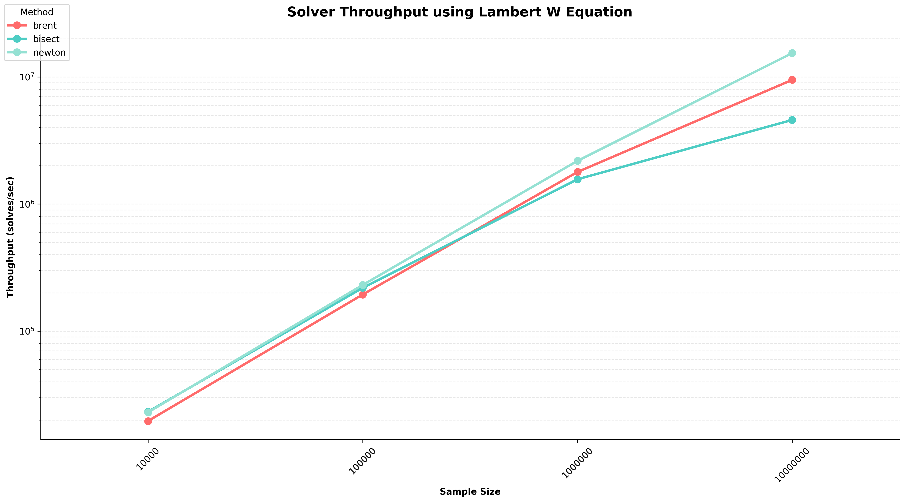
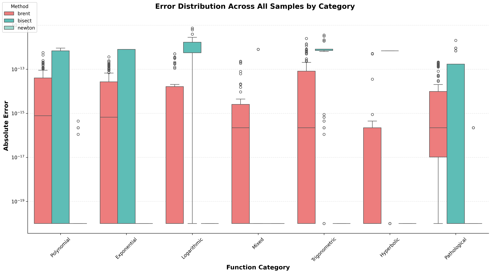

# Rapid-Roots

[](https://badge.fury.io/py/rapid-roots)
[](https://www.python.org/downloads/)
[](https://opensource.org/licenses/MIT)

General parallel vectorised root solver using Numba for large data volumes. 

## Quick Start
```bash
pip install rapid-roots
```

```python
from rapid_roots.solvers import RootSolvers
from numba import njit
import numpy as np

@njit
def f(x, a):
    return x**2 - a

@njit
def f_prime(x, a):
    return 2*x


# Creates function parameter a in the equation.
params = np.full((10000, 1), 4.0)


# Creates a and b bounds for backup bracketed solvers
a = np.zeros(10000)
b = np.full(10000, 10.0)

# Creates x0 initial guess for main Newton solver
x0 = (a + b) / 2

# Vectorised solver implementation solves 10,000 problems at once.
roots, iters, converged = RootSolvers.get_root(
    func=f, a=a,  b=b, x0=x0, func_prime=f_prime, 
    func_params=params, main_solver='newton', 
    use_backup=True 
)

print(f"Solved {converged.sum()} problems") # Solved 10,000 problems
print(f"Mean root: {roots.mean()}")         # Mean root: 2.0
```
## Performance


<table width="100%" align="center">
  <thead>
    <tr>
      <th align="center">Samples</th>
      <th colspan="3" align="center">Throughput (Solves/sec)</th>
    </tr>
    <tr>
      <th></th>
      <th align="center">Newton</th>
      <th align="center">Brent</th>
      <th align="center">Bisection</th>
    </tr>
  </thead>
  <tbody>
    <tr>
      <td align="center">10K</td>
      <td align="center">22,951</td>
      <td align="center">19,632</td>
      <td align="center">23,219</td>
    </tr>
    <tr>
      <td align="center">100K</td>
      <td align="center">231,065</td>
      <td align="center">194,212</td>
      <td align="center">219,248</td>
    </tr>
    <tr>
      <td align="center">1M</td>
      <td align="center">2,187,503</td>
      <td align="center">1,787,564</td>
      <td align="center">1,566,471</td>
    </tr>
    <tr>
      <td align="center">10M</td>
      <td align="center">15,404,269</td>
      <td align="center">9,486,609</td>
      <td align="center">4,589,518</td>
    </tr>
  </tbody>
</table>

## Accuracy


Box plot compares the absolute error distributions against Scipy for Brent, Bisection and Newton implementation across different function categories.

Newton shows the lowest median error with occasinal ouliers in challenging categories. Brent is slightly higher in median errors with a wider interquantile range. Meanwhile Bisection displays the largest spread and highest typical error.

Results show errors approach machine precision for all methods against scipy.


